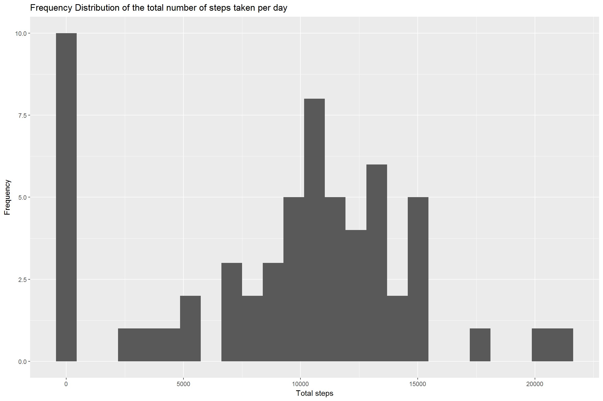
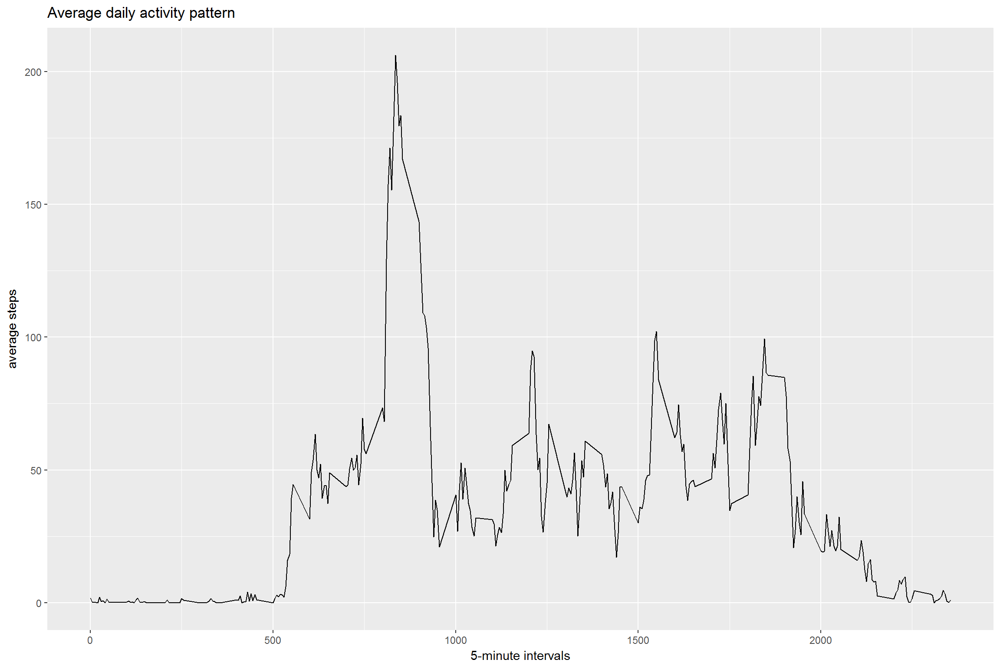
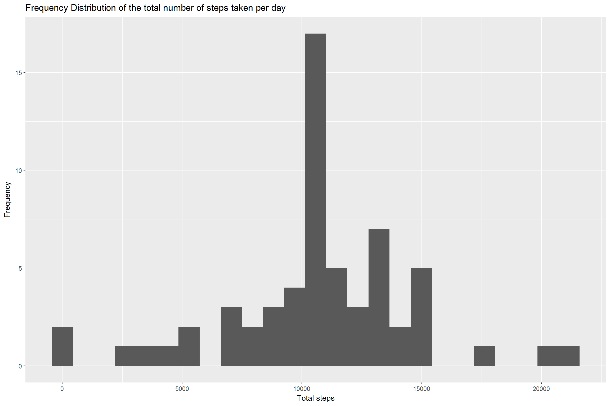
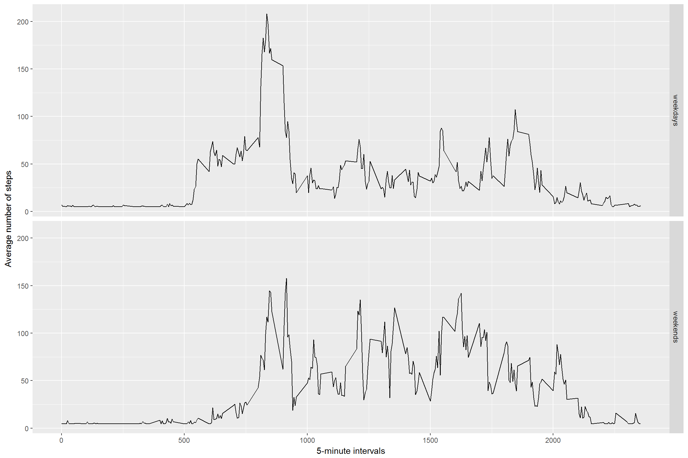

install required package
------------------------

    library(ggplot2)
    library(timeDate)

Reading and preprocessing the data from online data source
----------------------------------------------------------

read the data and process data in terms of the original structre of the
data, store into the two data set for future use.

    if(!file.exists("repdata-data-activity.zip")) {
      temp <- tempfile()
      download.file("https://d396qusza40orc.cloudfront.net/repdata%2Fdata%2Factivity.zip",temp)
      file <- unzip(temp)
      unlink(temp)
    }
    data <- read.csv(file, header=T, na.strings="NA")
    str(data)

    ## 'data.frame':    17568 obs. of  3 variables:
    ##  $ steps   : int  NA NA NA NA NA NA NA NA NA NA ...
    ##  $ date    : Factor w/ 61 levels "2012-10-01","2012-10-02",..: 1 1 1 1 1 1 1 1 1 1 ...
    ##  $ interval: int  0 5 10 15 20 25 30 35 40 45 ...

    data$date <- as.Date(data$date)
    Data <- data

What is mean total number of steps taken per day?
-------------------------------------------------

Calculate the total number of steps taken per day and hist it

    total <- aggregate(data$steps, by=list(data$date), FUN=sum,na.rm=TRUE)
    names(total) <- c("date", "total")
    ggplot(data=total, aes(total)) + geom_histogram(bins=25) + labs(x="Total steps",y="Frequency",title="Frequency Distribution of the total number of steps taken per day")

Calculate and report the mean and median of the total number of steps
taken per day

    means <- mean(total$total)
    medians <- median(total$total)
    cbind(means,medians)

    ##        means medians
    ## [1,] 9354.23   10395

The mean is 9354.23 and median is 10395

What is the average daily activity pattern?
-------------------------------------------

Calculate the mean of steps of the 5-minute interval and plot it

    avg <- aggregate(data$steps, by=list(data$interval), FUN=mean,na.rm=TRUE)
    names(avg) <- c("interval", "mean")
    ggplot(data=avg,aes(interval,mean)) + geom_line() + labs(x="5-minute intervals",y="average steps",title="Average daily activity pattern")

the interval 835 contains maximum number of steps 206 .

    max <- max(avg$mean)
    maxint <- avg$interval[which.max(avg$mean)]
    cbind(max,maxint)

    ##           max maxint
    ## [1,] 206.1698    835

Imputing missing values
-----------------------

Calculate and report the total number of missing values in the dataset

    NA.count <- sum(is.na(Data$steps))
    NA.count

    ## [1] 2304

a strategy for filling in all of the missing values, we use the most
simple way to input it, the global mean and then hist it. The mean and
median impove a lot comparing to the data with missing value. Becasue,
when calculating the daily average steps, we treat those whole day
missing values as 0 instead of droping out the whole day which would
cause to incomplete two months data. Now when those zero values increase
to the global mean, the mean and median would natually increase.

    NA.location <- which(is.na(Data$steps))
    Data$steps[NA.location] <- mean(Data$steps,na.rm=T)
    totalD <- aggregate(Data$steps, by=list(Data$date), FUN=sum)
    names(totalD) <- c("Date", "total")
    ggplot(data=totalD, aes(total)) + geom_histogram(bins=25) + labs(x="Total steps",y="Frequency",title="Frequency Distribution of the total number of steps taken per day")

    meanD <- mean(totalD$total)
    medianD <- median(totalD$total)
    cbind(meanD,medianD)

    ##         meanD  medianD
    ## [1,] 10766.19 10766.19

Are there differences in activity patterns between weekdays and weekends?
-------------------------------------------------------------------------

    Data$weekday <- isWeekday(Data$date, wday=1:5)
    Data$weekday<- ifelse(Data$weekday  == TRUE, "weekdays", "weekends")
    average <- aggregate(steps ~ interval + weekday, data=Data, FUN=mean)
    ggplot(average, aes(interval, steps)) + geom_line() + facet_grid(weekday ~ .) +
      xlab("5-minute intervals") + ylab("Average number of steps") 

Yes, there are difference between weekdays and weekends. Weekdays have
higher peak than weekends. The average steps is quite stable during the
daytime in weekends and there are no obvious peak at some time point. On
the contrary, The peak is very apparent and it appears in the morning.
